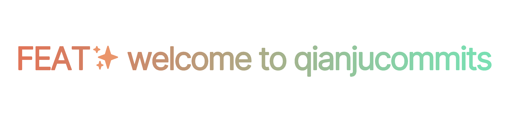

简而有法、流畅自然的提交规范

---


# qianjucommits

qianjucommits 的规范正在制定中，详情请见：spec

## 语义化版本

qianjucommits 的版本发行受 [语义化版本 2.0.0](https://semver.org/lang/zh-CN/spec/v2.0.0.html) 约束。

## 许可证

qianjucommits 按 [Mozilla Public License 2.0](https://github.com/qianjunakasumi/qianjucommits/blob/main/LICENSE) 授权和发行。


```
Copyright (c) 2022 qianjunakasumi <i@qianjunakasumi.ren>

This Source Code Form is subject to the terms of the Mozilla Public
License, v. 2.0. If a copy of the MPL was not distributed with this
file, You can obtain one at http://mozilla.org/MPL/2.0/.
```
